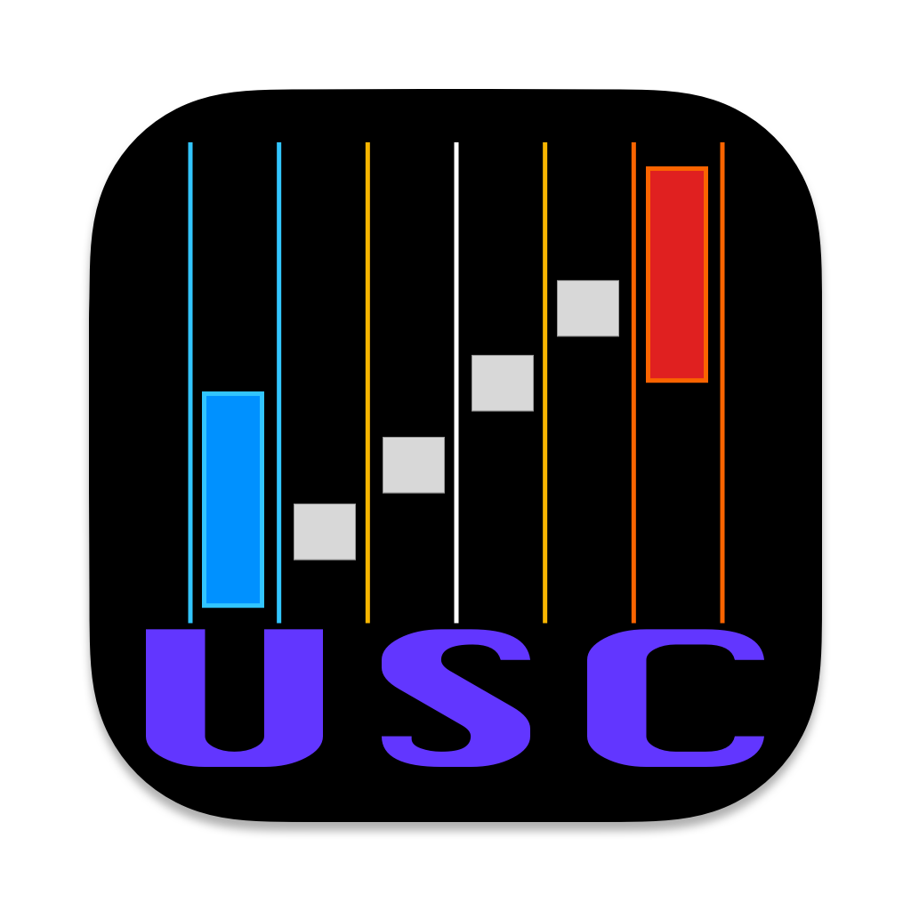
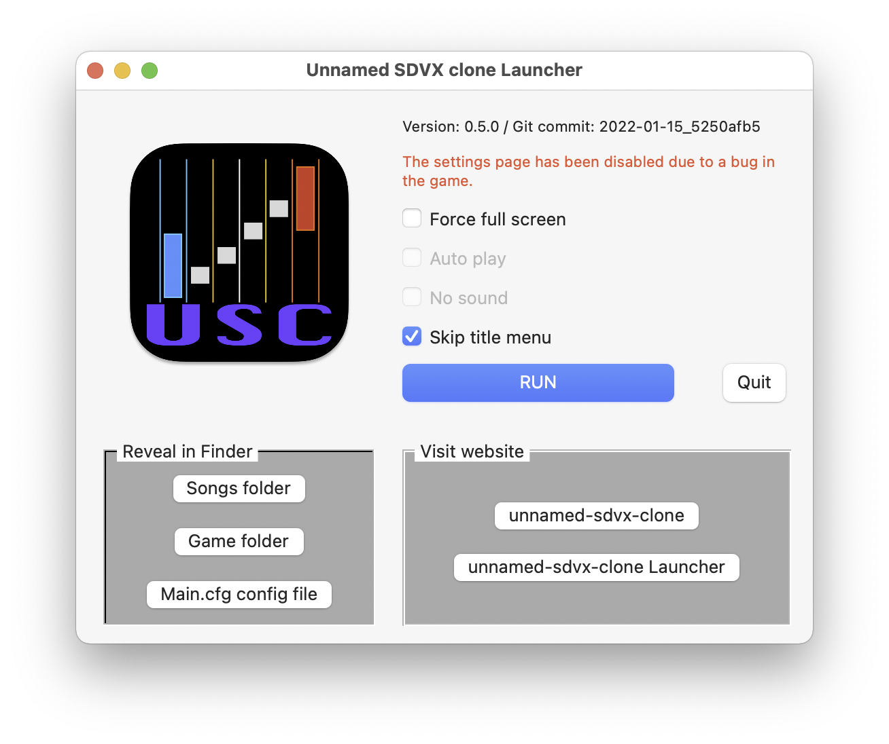

USCLauncher
===========



- [unnamed-sdvx-clone](https://github.com/Drewol/unnamed-sdvx-clone/) build for MacOS
- MacOS: 10.13+
- Arch: x86_64/aarm64
- NO SONGS inside
- [Download/Open/Run](https://github.com/serge-ivamov/USCLauncher/releases/download/v1.0.1/USCLauncher-Installer-1.0.1.dmg)

# News
- Version 1.0.1 released
  - Improved game launch.
  - New build of the game (Git commit: 2023-01-22_6629139d).
  - Should now work on pure macOS, without installing homebrew.

# Problems
- Modern macos do not allow unsigned applications to run, so you need to remove the quarantine flags to run them:
  ```bash
  $ xattr -c /Applications/USCLauncher.app
  ```

# Screenshot


